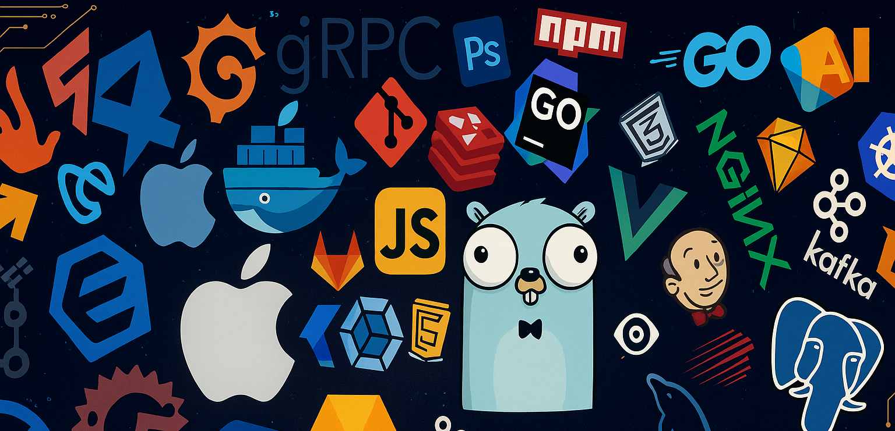

<div align="center">
  
</div>

<div align="center">
  <h1>
    
  </h1>
</div>

<div align="center">
  
</div>

<div align="center" style="margin-top:15px;">
  
  
  
</div>
<br/>

```javascript
const sachira = {
  name: "Sachira Nadeesharika",
  location: "Sri Lanka 🇱🇰",
  email: "sachirasanthus81@gmail.com", 
  
  languages: ["JavaScript", "Python", "Java", "C++", "C", "PHP"],
  
  passionateAbout: [
    "Full-Stack Development (MERN)", 
    "IoT & Embedded Systems", 
    "Mobile Applications", 
    "Machine Learning",
    "Automation Technology"
  ],
  
  techStack: {
    web: ["React.js", "Node.js", "Express.js", "Laravel", "Tailwind CSS"],
    mobile: ["React Native", "Flutter"],
    iot: ["Arduino", "ESP32", "Raspberry Pi", "Sensors"],
    ml: ["Scikit-learn", "Pandas", "NumPy"],
    databases: ["MongoDB", "MySQL"],
    tools: ["Git", "Docker", "Figma", "Postman", "VS Code", "Arduino IDE"]
  },
  
  currentlyLearning: ["Advanced Laravel", "MERN Stack with Docker", "Automation Engineering"],
  
  hobbies: [
    "Building Electronics Projects 🤖",
    "Mobile Photography 📸",
    "Learning New Tech",
    "Coding"
  ],
  
  motto: "Where code meets creativity, and ideas become reality 🚀" // From your previous README
};
```
---
<h3 align="center">📊 GitHub Journey</h3>

<div align="center">
<table align="center">
<tr border="none">
<td width="50%" align="center">
  
  
<br/>
<br/>
</td>
<td width="50%" align="center">

  

  </td>
</tr>
</table>
</div>
<h3 align="center">🛠️ Technology Stack</h3>

<div align="center">

**Development Environments & Design**
<br/>


**Programming Languages**
<br/>


**Frontend Technologies**
<br/>


**Backend & Databases**
<br/>


**Mobile & Cloud**
<br/>


**Development Tools**
<br/>

</div>
<div align="center">
  
</div>

<h3 align="center">🤝 Let's Connect & Collaborate</h3>

---

##  Core Competencies

### 🌐 Full-Stack Web Development
- **MERN Stack** (MongoDB, Express.js, React.js, Node.js)
- **RESTful API** Development & Integration
- **Real-time Applications** with WebSocket
- **Responsive UI/UX** Design

### 📱 Mobile Application Development
- **React Native** - Cross-platform mobile apps
- **Flutter & Dart** - Native performance mobile solutions
- **Expo CLI** - Rapid mobile app development
- **Mobile API Integration** - Seamless backend connectivity
- **Real-time Mobile Dashboards** - Live data visualization
- **Cross-Platform Development** - iOS and Android

### 🤖 IoT & Embedded Systems
- **ESP32 Programming** - Microcontroller development
- **Arduino IDE** - Embedded systems programming
- **Sensor Integration** - DHT11/22, Soil Moisture, Temperature
- **IoT Communication** - HTTP/HTTPS, WiFi protocols
- **Real-time Data Collection** - Sensor to cloud integration

### 🧠 Machine Learning & AI
- **Supervised Learning** - Classification and Regression
- **Random Forest Algorithm** - High accuracy predictions
- **Data Preprocessing** - Pandas, NumPy
- **Model Deployment** - Flask microservices
- **Predictive Analytics** - Real-world problem solving

---

<div align="center">
  
</div>

<div align="center">
  
  <h3>🚀 Always learning, always building, always innovating! 🚀</h3>
  <p><em>"Where code meets creativity, and ideas become reality"</em></p>
  
</div>

<div align="center">
  
</div>
