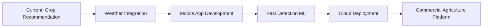

<div align="center">
  
</div>

<h3 align="center" style="color:#E91E63;">Undergraduate Student | IoT & Embedded Systems Enthusiast | ESP32/Arduino Developer | Learning Full-Stack Web Development (MERN)</h3>

<div align="center">
  
</div>

<div align="center" style="margin-top:15px;">
  
  
  
</div>
<br/>

```javascript
const sachira = {
  name: "K.A.S.S. Nadeesharika (Sachira Santhush)",
  studentId: "KAN/IT/2022/F/0088",
  location: "Kandy, Sri Lanka 🇱🇰",
  email: "sachira.santhush@example.com",
  pronouns: "He/Him",
  
  languages: ["JavaScript", "Python", "C++", "Arduino/C", "HTML", "CSS"],
  
  passionateAbout: [
    "IoT & Embedded Systems", 
    "Smart Agriculture Solutions", 
    "Machine Learning Integration", 
    "Full-Stack Development",
    "Sustainable Technology"
  ],
  
  techStack: {
    frontend: ["React.js", "HTML5", "CSS3", "JavaScript"],
    backend: ["Node.js", "Express.js", "Flask", "RESTful APIs"],
    databases: ["MongoDB", "NoSQL"],
    iot: ["ESP32", "Arduino", "DHT11", "Soil Sensors"],
    ml: ["Python", "scikit-learn", "pandas", "Random Forest"],
    tools: ["Git", "GitHub", "Postman", "VS Code"]
  },
  
  currentlyLearning: ["Advanced ML Algorithms", "Weather API Integration", "Mobile Development", "Cloud Deployment"],
  
  hobbies: [
    "IoT Hardware Projects",
    "Agriculture Technology",
    "Reading Tech Blogs",
    "Arduino Programming",
    "Sensor Integration 🌱"
  ],
  
  motto: "Bridging traditional farming with modern technology 🌾"
};
```

---

## 🚀 About Me

I'm a passionate **Information Technology undergraduate** at Advanced Technological Institute, Kandy, specializing in **IoT systems** and **smart agriculture solutions**. I enjoy working on projects that combine **embedded systems**, **machine learning**, and **web development** to solve real-world problems.

- 🔭 I'm currently working on **Crop Recommendation System using MERN + Flask + C++**
- 🌱 I'm currently learning **Advanced Machine Learning**, **Weather API Integration**, and **Mobile Development**
- 👯 I'm looking to collaborate on **IoT Agriculture Projects**, **Smart Farming Solutions**
- 🤔 I'm looking for help with **Cloud Deployment** and **Advanced Sensor Integration**
- 💬 Ask me about **ESP32 Development**, **IoT Sensor Integration**, **MERN Stack**, **Agricultural ML**
- 📫 How to reach me: **sachira.santhush@example.com**
- ⚡ Fun fact: **I can make plants "talk" to computers using IoT sensors! 🌿📡**

---

<h3 align="center">🌟 Current Project Spotlight</h3>

<div align="center">

| 🚀 **Currently Building** | 📚 **Learning Journey** | 🎯 **Future Goals** |
|:-------:|:-------:|:-------:|
| Crop Recommendation System | Advanced ML Algorithms | Weather Data Integration |
| IoT Sensor Networks | Mobile Development | Open Source Contributions |
| MERN Stack Applications | Cloud Architecture | Speaking at Tech Events |

</div>

---

<h3 align="center">📊 GitHub Statistics</h3>

<div align="center">
<table align="center">
<tr border="none">
<td width="50%" align="center">
  
  
  
<br/>
<br/>

  [](#)
  
</td>
<td width="50%" align="center">

  
  
</td>
</tr>
</table>
</div>

<div align="center">
  
</div>

---

<h3 align="center">🛠️ Technology Stack</h3>

<div align="center">

**Development Environments & Tools**
<br/>


**Programming Languages**
<br/>


**Frontend Technologies**
<br/>


**Backend & Databases**
<br/>


**IoT & Hardware**
<br/>


**Machine Learning**
<br/>


</div>

---

<h3 align="center">🏆 Featured Projects</h3>

<div align="center">

### 🌾 **Crop Recommendation System**
**MERN + Flask + ESP32 | August 2025**

A comprehensive smart agriculture solution integrating IoT sensors, machine learning, and modern web technologies.

**🔧 Tech Stack:** ESP32, DHT11, React.js, Node.js, Flask, MongoDB, Random Forest ML

**✨ Key Achievements:**
- 95% ML model accuracy for crop prediction
- Real-time IoT data collection and processing  
- Sub-2 second response time from sensor to recommendation
- Modular architecture supporting multiple sensor types

[🔗 View Project](#) | [📊 Live Demo](#)

---

### 🔮 **Upcoming Projects**

**🌦️ Weather-Integrated Crop System**
- Weather API integration for enhanced predictions
- Extended crop database with regional varieties

**📱 Mobile Agriculture App**  
- Cross-platform mobile application
- Offline functionality for remote areas

**🐛 Pest Detection System**
- Computer vision for pest identification
- Early warning system integration

</div>

---

<h3 align="center">📚 Academic Journey</h3>

<div align="center">

| **Institution** | **Program** | **Focus Areas** |
|:-------:|:-------:|:-------:|
| **Advanced Technological Institute** | Information Technology | IoT Development, ML Integration |
| **Kandy, Sri Lanka** | Undergraduate (2022-Present) | Smart Agriculture, Web Development |

**Student ID:** KAN/IT/2022/F/0088  
**Major Projects:** Crop Recommendation System, IoT Sensor Networks  
**Supervisor:** Mr. N. Jayasekara

</div>

---

<h3 align="center">🎯 Future Roadmap</h3>

<div align="center">



**2025 Goals:**
- 🌦️ **Weather API Integration** - Real-time weather data incorporation
- 📱 **Mobile Application** - Flutter/React Native development  
- 🐛 **Pest Detection** - Computer vision ML integration
- ☁️ **Cloud Deployment** - AWS/GCP scaling and deployment
- 🤝 **Open Source Contribution** - Share agriculture IoT libraries

</div>

---

<h3 align="center">🤝 Let's Connect & Collaborate</h3>

<div align="center">
<a href="https://www.linkedin.com/in/sachira-santhush" target="_blank">
  
</a>
<a href="mailto:sachira.santhush@example.com" target="_blank">
  
</a>
<a href="https://twitter.com/SachiraSanthush" target="_blank">
  
</a>
<a href="https://dev.to/sachirapro" target="_blank">
  
</a>
</div>

---

<h3 align="center">🌟 Support My Work</h3>

<div align="center">
  <p>If my IoT and agriculture projects inspire you, consider supporting my research! 🌱</p>
  <a href="https://www.buymeacoffee.com/sachirapro" target="_blank">
    
  </a>
</div>

<br/>
<div align="center" style="margin-top: 20px;">
  
</div>

---

<div align="center">
  
</div>

<div align="center">
  
</div>

<h4 align="center">💖 Thanks for visiting! Let's build something amazing together! 🚀</h4>

---

⭐️ From [SACHIRAPro](https://github.com/SACHIRAPro)
