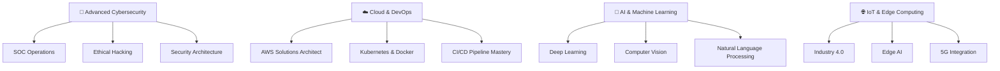

# <div align="center">🌟 Welcome to My Digital Universe 🌟</div>

<div align="center">
  
</div>

<div align="center">
  <h1>
    
    &nbsp;Hi, I'm Sachira Nadeesharika&nbsp;
    
  </h1>
</div>

<div align="center">
  
</div>

<div align="center">
  
</div>

<div align="center">
  
</div>

---

##  About Me

<table>
<tr>
<td width="50%">


### 🎯 Current Journey
- 🎓 **Final-year HND in IT** at **SLIATE, Sri Lanka**
- 🌱 **Specializing in IoT & Smart Agriculture Systems**
- 🔍 **Actively seeking internships** across multiple tech domains
- 📚 **Developing cutting-edge solutions** for real-world challenges
- 🚀 **Building innovative projects** that merge technology with agriculture

### 💼 Expertise Areas
- 🧑‍💻 **Full-Stack Web Development** (MERN Stack)
- 🤖 **IoT Systems & Embedded Programming**
- 🧠 **Machine Learning & AI Integration**
- 📊 **Business Analysis & Data-Driven Solutions**
- 🔐 **Cybersecurity & Information Security**
- 🎨 **UI/UX Design & User Experience**

</td>
<td width="50%">

### 🌟 Core Philosophy
```yaml
mindset:
  - Innovation_First: "Technology should solve real problems"
  - Sustainability_Focus: "Building solutions for a better future"
  - Continuous_Learning: "Every challenge is a growth opportunity"
  - Collaboration_Driven: "Great solutions emerge from teamwork"
  
mission: |
  Bridging the gap between traditional practices and 
  modern technology through innovative IoT and AI solutions
  
vision: |
  To create sustainable, intelligent systems that empower
  communities and drive positive global impact
```

### 🎯 Achievement Stats
- 📅 **Coding Journey:** 3+ years
- 🏆 **Major Projects:** 15+ completed
- 🌐 **Tech Stack Mastery:** 20+ technologies
- 🤖 **IoT Projects:** 5+ deployed systems
- ☕ **Innovation Fuel:** ∞ cups of coffee

</td>
</tr>
</table>

---

##  Technology Arsenal

### 💻 Programming Languages
<div align="center">
  
</div>

### 🎨 Frontend Technologies
<div align="center">
  
</div>

### ⚙️ Backend & Databases
<div align="center">
  
</div>

### 🤖 IoT & Embedded Systems
<div align="center">
  
  
  
  
</div>

### 🧠 AI & Machine Learning
<div align="center">
  
  
  
  
</div>

### 🛠️ Development Tools
<div align="center">
  
</div>

---

##  Flagship Projects

<div align="center">
  
</div>

<table>
<tr>
<td width="50%">

### 🌾 Smart Crop Recommendation System


**AI-powered agriculture solution with real-time IoT integration**

🔹 **Revolutionary Features:**
- 🌡️ Real-time environmental monitoring with ESP32
- 🤖 Machine Learning crop prediction (95% accuracy)
- 📱 Live dashboard with interactive data visualization
- 🔗 Seamless IoT-to-cloud data pipeline
- 📊 Advanced analytics and recommendation engine

🔹 **Tech Innovation:** `MERN Stack` `Flask ML API` `ESP32 IoT` `Random Forest ML` `MongoDB` `Real-time Charts`

🔹 **Impact:** ✅ Deployed & Helping Farmers Make Data-Driven Decisions

</td>
<td width="50%">

### 🏛️ Grama Sevaka Management System


**Comprehensive community management platform**

🔹 **Advanced Features:**
- 🗺️ GIS Integration for precise location services
- 📅 Intelligent appointment scheduling system
- 💬 Community engagement forums
- ⚖️ Digital legal case management
- 📊 Real-time analytics and reporting dashboard

🔹 **Tech Stack:** `React` `Express.js` `MongoDB` `Node.js` `GIS APIs` `TailwindCSS`

🔹 **Status:** ✅ Successfully Deployed & Active

</td>
</tr>
</table>

<table>
<tr>
<td width="50%">

### 📱 Dynamic QR Code Generator


**Next-generation QR code creation platform**

🔹 **Smart Features:**
- 🎨 Advanced customizable designs & themes
- 📱 Multi-platform social media integration
- 🌈 Dynamic color schemes and branding
- 📊 Built-in analytics and tracking
- 💾 Multiple export formats (SVG, PNG, PDF)

🔹 **Technology:** `HTML5` `CSS3` `JavaScript` `Canvas API` `Chart.js`

🔹 **Recognition:** ✅ Featured Project with High User Engagement

</td>
<td width="50%">

### 🔧 More Innovative Solutions


**Portfolio of specialized applications**

🔹 **Project Categories:**
- 🏪 **E-commerce Solutions** - Custom online stores
- 📊 **Data Visualization Tools** - Interactive dashboards  
- 🔐 **Security Applications** - Authentication systems
- 🎮 **Interactive Web Apps** - Engaging user experiences
- 📱 **Mobile-First Designs** - Responsive applications

🔹 **Continuous Innovation:** Always working on cutting-edge solutions

🔹 **Open Source:** Contributing to the developer community

</td>
</tr>
</table>

---

##  Learning & Development Path

<div align="center">
  
</div>

### 🎯 Current Learning Trajectory



### 📚 Mastery Progress Tracker

<table>
<tr>
<td width="50%">

**🔐 Cybersecurity Excellence Track**
- ✅ Network Security Fundamentals
- ✅ Ethical Hacking & Penetration Testing
- 🔄 SOC Analyst Certification Path
- 🔄 OWASP Security Implementation
- ⏳ Advanced Incident Response
- ⏳ Digital Forensics & Investigation

</td>
<td width="50%">

**☁️ Cloud Architecture Track**
- ✅ Linux System Administration
- ✅ Git Advanced Workflows
- 🔄 AWS Solutions Architect
- 🔄 Docker Containerization Mastery
- ⏳ Kubernetes Orchestration
- ⏳ Terraform Infrastructure as Code

</td>
</tr>
</table>

<table>
<tr>
<td width="50%">

**🤖 AI & ML Specialization**
- ✅ Machine Learning Fundamentals
- ✅ Data Science with Python
- 🔄 Deep Learning with TensorFlow
- 🔄 Computer Vision Applications
- ⏳ NLP & Language Models
- ⏳ MLOps & Model Deployment

</td>
<td width="50%">

**🌐 IoT Innovation Track**
- ✅ Embedded Systems Programming
- ✅ Sensor Integration & Data Collection
- 🔄 Edge Computing Solutions
- 🔄 Industrial IoT Applications
- ⏳ 5G & IoT Integration
- ⏳ Smart City Technologies

</td>
</tr>
</table>

---

##  GitHub Analytics & Performance

<div align="center">
  
</div>

<div align="center">
  
  
</div>

<div align="center">
  
</div>

---

##  Development Activity & Contributions

<div align="center">
  
</div>

### 💻 Weekly Coding Distribution

```text
🟦 JavaScript     ████████████████████████████████████████   42.3%
🟨 Python         █████████████████████████████              28.1%  
🟧 HTML/CSS       ████████████████                           16.7%
🟪 C++            ████████                                    8.2%
🟩 PHP            ████                                        4.7%
```

---

##  Achievements & Recognition

<div align="center">
  
</div>

### 🏆 Notable Achievements
- 🌾 **Smart Agriculture Innovation:** Developed IoT-based crop recommendation system
- 🎯 **95% ML Model Accuracy:** Achieved high precision in agricultural predictions
- 🏛️ **Community Impact:** Created digital governance solutions for local communities
- 📊 **Data-Driven Solutions:** Built real-time analytics dashboards
- 🔧 **Full-Stack Mastery:** Expertise across complete development lifecycle

---

##  Connect & Collaborate

<div align="center">
  
</div>

<div align="center">
  <table>
    <tr>
      <td align="center">
        <a href="https://www.linkedin.com/in/vidushan-samarakoon-435428287/">
          
        </a>
      </td>
      <td align="center">
        <a href="mailto:thiwankasamarakoon6@gmail.com">
          
        </a>
      </td>
      <td align="center">
        <a href="https://github.com/VshanX">
          
        </a>
      </td>
    </tr>
    <tr>
      <td align="center">
        <a href="#portfolio">
          
        </a>
      </td>
      <td align="center">
        <a href="#projects">
          
        </a>
      </td>
      <td align="center">
        <a href="#collaboration">
          
        </a>
      </td>
    </tr>
  </table>
</div>

---

##  Personal Values & Vision

<div align="center">
  
</div>

<table>
<tr>
<td width="50%">

### 🎯 Professional Interests
- 🌱 **Sustainable Technology** - Building eco-friendly solutions
- 🤖 **IoT & Smart Systems** - Connecting the physical and digital worlds
- 🔬 **Research & Innovation** - Exploring cutting-edge technologies
- 📊 **Data-Driven Decision Making** - Leveraging analytics for insights
- 🌍 **Global Impact Projects** - Creating solutions that matter

### 🎨 Creative Dimensions
- 🖌️ **Digital Innovation** - Crafting pixel-perfect user experiences
- 📸 **Technology Documentation** - Sharing knowledge through visuals
- ✍️ **Technical Communication** - Making complex concepts accessible
- 🎭 **User-Centered Design** - Building intuitive and engaging interfaces

</td>
<td width="50%">

### 🔮 Future Aspirations
- 🚀 **Tech Entrepreneur** - Launching innovative startups
- 🌍 **Global Technology Leader** - Influencing industry standards
- 🏆 **Innovation Catalyst** - Driving technological advancement
- 🤝 **Community Builder** - Fostering tech education and growth
- 📈 **Continuous Evolution** - Always pushing boundaries

### 🎪 Personal Touch
- 🌟 **Peak Performance:** Late-night coding marathons
- 🍕 **Creative Fuel:** Coffee, music, and determination
- 🎯 **Life Motto:** "Innovate today, transform tomorrow"
- 🦄 **Hidden Superpower:** Debugging complex IoT systems
- 🎸 **Beyond Code:** Music production and creative arts

</td>
</tr>
</table>

---

##  Innovation Philosophy

<div align="center">
  
</div>

<div align="center">
  
</div>

---

##  Profile Analytics & Engagement

<div align="center">
  
  
</div>

<div align="center">
  
</div>

---

<div align="center">
  
</div>

<div align="center">
  
  <h2>🌟 Ready to Innovate Together? 🌟</h2>
  <h3>Let's build the future with intelligent, sustainable technology! 🚀</h3>
  <p><em>"Where IoT meets AI, and ideas become reality"</em></p>
  
</div>

<div align="center">
  
</div>
