# <div align="center">🌟 Welcome to My Digital Universe 🌟</div>

<div align="center">
  
</div>

<div align="center">
  <h1>
    
    &nbsp;Hi, I'm Sachira Nadeesharika&nbsp;
    
  </h1>
</div>

<div align="center">
  
</div>

<div align="center">
  
</div>

<div align="center">
  
</div>

<div align="center">
  
</div>

---

##  About Me

<table>
<tr>
<td width="50%">


### 🎯 Current Journey
- 🎓 **Final-year HND in IT** at **SLIATE, Sri Lanka**
- 🌱 **Specializing in IoT & Smart Agriculture Systems**
- 🔍 **Actively seeking internships** across multiple tech domains
- 📚 **Developing cutting-edge solutions** for real-world challenges
- 🚀 **Building innovative projects** that merge technology with agriculture

### 💼 Core Expertise Areas
- 🧑‍💻 **Full-Stack Web Development** (MERN Stack)
- 📱 **Mobile Application Development** (React Native, Flutter)
- 🤖 **Embedded Systems Programming** (Arduino, ESP32)
- 🔌 **IoT Sensor Integration & Data Collection**
- 🧠 **Machine Learning & Predictive Analytics**
- 🌐 **API Development & Microservices Architecture**
- 🎨 **UI/UX Design & User Experience**

</td>
<td width="50%">

### 🌟 Core Philosophy
```yaml
mindset:
  - Innovation_First: "Technology should solve real problems"
  - Sustainability_Focus: "Building solutions for a better future"
  - Continuous_Learning: "Every challenge is a growth opportunity"
  - Collaboration_Driven: "Great solutions emerge from teamwork"
  
mission: |
  Bridging the gap between traditional practices and 
  modern technology through innovative IoT and AI solutions
  
vision: |
  To create sustainable, intelligent systems that empower
  communities and drive positive global impact
```

### 🎯 Achievement Stats
- 📅 **Coding Journey:** 3+ years
- 🏆 **Major Projects:** 15+ completed
- 🌐 **Tech Stack Mastery:** 20+ technologies
- 🤖 **IoT Projects:** 5+ deployed systems
- ☕ **Innovation Fuel:** ∞ cups of coffee

</td>
</tr>
</table>

---

##  Technology Arsenal

### 💻 Programming Languages & Core Technologies
<div align="center">
  
</div>

### 🎨 Frontend Development Stack
<div align="center">
  
</div>

### 📱 Mobile Development Technologies
<div align="center">
  
  
  
  
  
  
</div>

### ⚙️ Backend Technologies & Databases
<div align="center">
  
</div>

### 🤖 Embedded Systems & IoT Development
<div align="center">
  
  
  
  
  
  
</div>

### 🧠 Machine Learning & Data Science
<div align="center">
  
  
  
  
</div>

### 🛠️ Development Tools & Environment
<div align="center">
  
  
  
</div>

---

##  Flagship Projects

<div align="center">
  
</div>

<table>
<tr>
<td width="50%">

### 🌾 Smart Crop Recommendation System


**AI-powered agriculture solution with real-time IoT integration**

🔹 **Technical Implementation:**
- 🌡️ **ESP32 Microcontroller:** Real-time environmental monitoring
- 📡 **DHT11/22 Sensors:** Temperature and humidity data collection
- 💧 **Soil Moisture Sensors:** Advanced soil condition monitoring
- 🤖 **Random Forest ML Model:** 95% prediction accuracy
- 📱 **Real-time Dashboard:** Live data visualization and charts
- 🔗 **HTTP API Integration:** Seamless IoT-to-cloud communication
- 📊 **MongoDB Database:** Efficient sensor data storage

🔹 **Tech Innovation:** `MERN Stack` `Flask ML Microservice` `ESP32 IoT` `Arduino IDE` `Random Forest Algorithm` `DHT11/22 Sensors` `MongoDB` `Real-time Data Processing`

🔹 **Impact:** ✅ Deployed & Helping Farmers Make Data-Driven Decisions

</td>
<td width="50%">

### 🏛️ Grama Sevaka Management System


**Comprehensive community management platform**

🔹 **Advanced Features:**
- 🗺️ GIS Integration for precise location services
- 📅 Intelligent appointment scheduling system
- 💬 Community engagement forums
- ⚖️ Digital legal case management
- 📊 Real-time analytics and reporting dashboard

🔹 **Tech Stack:** `React` `Express.js` `MongoDB` `Node.js` `GIS APIs` `TailwindCSS`

🔹 **Status:** ✅ Successfully Deployed & Active

</td>
</tr>
</table>

<table>
<tr>
<td width="50%">

### 📱 Dynamic QR Code Generator


**Next-generation QR code creation platform**

🔹 **Smart Features:**
- 🎨 Advanced customizable designs & themes
- 📱 Multi-platform social media integration
- 🌈 Dynamic color schemes and branding
- 📊 Built-in analytics and tracking
- 💾 Multiple export formats (SVG, PNG, PDF)

🔹 **Technology:** `HTML5` `CSS3` `JavaScript` `Canvas API` `Chart.js`

🔹 **Recognition:** ✅ Featured Project with High User Engagement

</td>
<td width="50%">

### 📱 Smart AgriMobile App


**Cross-platform mobile companion for smart farming**

🔹 **Mobile Features:**
- 📱 **Real-time Sensor Monitoring** - Live crop and soil data
- 🌡️ **Environmental Dashboard** - Temperature, humidity tracking
- 📊 **ML-Powered Recommendations** - Instant crop suggestions
- 🔔 **Smart Notifications** - Alerts for optimal farming conditions
- 📍 **GPS Field Mapping** - Location-based agricultural insights
- 📈 **Analytics & Reports** - Historical data visualization

🔹 **Technology:** `React Native` `Expo` `REST API Integration` `Real-time Charts` `Push Notifications`

🔹 **Status:** 🔄 In Development & Testing

</td>
<td width="50%">

### 🔧 More Innovative Solutions


**Portfolio of specialized applications**

🔹 **Project Categories:**
- 🏪 **E-commerce Solutions** - Custom online stores & mobile apps
- 📊 **Data Visualization Tools** - Interactive dashboards  
- 🔐 **Security Applications** - Authentication systems
- 🎮 **Interactive Applications** - Mobile games & utilities
- 📱 **Cross-Platform Apps** - React Native & Flutter projects
- 🤖 **IoT Mobile Controllers** - ESP32 device management apps

🔹 **Continuous Innovation:** Always working on cutting-edge solutions

🔹 **Open Source:** Contributing to the developer community

</td>
</tr>
</table>

---

##  Learning & Development Path

<div align="center">
  
</div>

### 🎯 Current Learning Trajectory

```mermaid
graph TD
    A[🤖 Advanced Embedded Systems] --> B[ARM Microcontrollers]
    A --> C[Real-time Operating Systems]
    A --> D[Industrial IoT Protocols]
    
    E[📱 Mobile Development Mastery] --> F[React Native Advanced]
    E --> G[Flutter & Dart Expertise]
    E --> H[Cross-Platform UI/UX]
    
    I[☁️ Cloud & DevOps] --> J[AWS IoT Core]
    I --> K[Docker Containerization]
    I --> L[CI/CD for Mobile Apps]
    
    M[🧠 Advanced Machine Learning] --> N[Deep Learning for IoT]
    M --> O[Edge AI Computing]
    M --> P[Mobile ML Integration]
```



### 📚 Mastery Progress Tracker

<table>
<tr>
<td width="50%">

**🤖 Embedded Systems & IoT Track**
- ✅ Arduino Programming & ESP32 Development
- ✅ Sensor Integration (DHT11/22, Soil Moisture)
- ✅ IoT Data Communication Protocols
- 🔄 ARM Cortex Microcontroller Programming
- 🔄 Real-time Systems Design
- ⏳ Industrial IoT Protocol Implementation
- ⏳ Edge Computing Solutions

</td>
<td width="50%">

**📱 Mobile Development Track**
- ✅ React Native Fundamentals
- ✅ Cross-Platform UI Development
- ✅ Mobile API Integration
- 🔄 Flutter & Dart Programming
- 🔄 Native Module Development
- ⏳ App Store Deployment
- ⏳ Mobile Performance Optimization

</td>
<td width="50%">

**☁️ Web Development & Cloud Track**
- ✅ MERN Stack Full Development
- ✅ RESTful API Design & Implementation
- ✅ Database Design & Optimization
- 🔄 AWS IoT Core Integration
- 🔄 Docker Containerization
- ⏳ GraphQL Advanced Patterns
- ⏳ Progressive Web Applications

</td>
</tr>
</table>

<table>
<tr>
<td width="50%">

**🧠 Machine Learning & Data Science Track**
- ✅ Machine Learning Fundamentals
- ✅ Data Science with Python & Pandas
- ✅ Random Forest & Classification Algorithms
- 🔄 Deep Learning for IoT Applications
- 🔄 Computer Vision for Agriculture
- ⏳ Edge AI & TinyML Implementation
- ⏳ Sensor Data Analytics & Prediction

</td>
<td width="50%">

**🌐 Advanced Development Track**
- ✅ Full-Stack JavaScript Development
- ✅ Mobile-First Design Principles
- ✅ Real-time Data Processing
- 🔄 Microservices Architecture
- 🔄 Mobile App Security & Authentication
- ⏳ DevOps for Mobile & IoT Applications
- ⏳ Scalable System Design

</td>
</tr>
</table>

---

##  GitHub Analytics & Performance

<div align="center">
  
</div>

<div align="center">
  
  
</div>

<div align="center">
  
</div>

---

##  Development Activity & Contributions

<div align="center">
  
</div>

### 💻 Weekly Coding Distribution

```text
🟦 JavaScript     ████████████████████████████████████████   42.3%
🟨 Python         █████████████████████████████              28.1%  
🟧 HTML/CSS       ████████████████                           16.7%
🟪 C++            ████████                                    8.2%
🟩 PHP            ████                                        4.7%
```

---

##  Achievements & Recognition

<div align="center">
  
</div>

### 🏆 Technical Achievements
- 🌾 **Smart Agriculture Innovation:** Developed complete IoT-based crop recommendation system
- 📱 **Cross-Platform Mobile Development:** Building React Native apps for agricultural solutions
- 🎯 **95% ML Model Accuracy:** Achieved high precision in agricultural predictions using Random Forest
- 🔌 **ESP32 Integration Master:** Successfully implemented real-time sensor data collection
- 📊 **Full-Stack Excellence:** Built end-to-end MERN applications with mobile integration
- 🤖 **IoT-Mobile Integration:** Seamlessly connected embedded systems with mobile applications
- 📱 **Real-time Mobile Systems:** Created live mobile dashboards with continuous sensor data streaming

---

##  Connect & Collaborate

<div align="center">
  
</div>

<div align="center">
  <table>
    <tr>
      <td align="center">
        <a href="https://www.linkedin.com/in/vidushan-samarakoon-435428287/">
          
        </a>
      </td>
      <td align="center">
        <a href="mailto:thiwankasamarakoon6@gmail.com">
          
        </a>
      </td>
      <td align="center">
        <a href="https://github.com/VshanX">
          
        </a>
      </td>
    </tr>
    <tr>
      <td align="center">
        <a href="#portfolio">
          
        </a>
      </td>
      <td align="center">
        <a href="#projects">
          
        </a>
      </td>
      <td align="center">
        <a href="#collaboration">
          
        </a>
      </td>
    </tr>
  </table>
</div>

---

##  Personal Values & Vision

<div align="center">
  
</div>

<table>
<tr>
<td width="50%">

### 🎯 Professional Focus Areas
- 🌱 **Smart Agriculture Technology** - Building IoT and mobile solutions for sustainable farming
- 🤖 **Embedded Systems Development** - Creating efficient sensor-based applications
- 📱 **Cross-Platform Mobile Development** - Crafting seamless mobile experiences
- 🔬 **IoT Research & Innovation** - Exploring cutting-edge sensor technologies
- 📊 **Real-time Data Processing** - Leveraging sensor data for intelligent mobile decisions
- 🌍 **Sustainable Tech Solutions** - Developing environmentally conscious applications

### 🎨 Technical Creativity
- 🖌️ **IoT System Design** - Architecting comprehensive embedded solutions
- 📱 **Mobile UI/UX Innovation** - Creating intuitive mobile interfaces for complex IoT systems
- 📸 **Technical Documentation** - Creating detailed project documentation
- ✍️ **Knowledge Sharing** - Writing tutorials on ESP32, React Native, and sensor integration
- 🎭 **User-Centered Design** - Building intuitive mobile interfaces for embedded systems

</td>
<td width="50%">

### 🔮 Future Technical Goals
- 🚀 **IoT & Mobile Startup Founder** - Launching innovative embedded system products with mobile apps
- 🌍 **Smart Agriculture Leader** - Pioneering agricultural technology solutions across web and mobile
- 📱 **Cross-Platform Development Expert** - Mastering React Native and Flutter ecosystems
- 🏆 **Embedded-Mobile Integration Specialist** - Becoming a recognized expert in IoT-mobile connectivity
- 🤝 **Tech Community Builder** - Fostering embedded systems, IoT, and mobile development education
- 📈 **Continuous Innovation** - Always pushing the boundaries of sensor-mobile integration

### 🎪 Behind the Code
- 🌟 **Peak Performance:** Late-night ESP32-mobile app integration sessions
- 🍕 **Creative Fuel:** Coffee, electronic music, breadboards, and mobile simulators
- 🎯 **Life Motto:** "Connect sensors, build mobile experiences, change lives"
- 🦄 **Hidden Superpower:** Debugging complex sensor-mobile communication issues
- 🎸 **Beyond Coding:** Electronics tinkering, mobile UI design, and DIY IoT mobile projects

</td>
</tr>
</table>

---

##  Innovation Philosophy

<div align="center">
  
</div>

<div align="center">
  
</div>

---

##  Profile Analytics & Engagement

<div align="center">
  
  
</div>

<div align="center">
  
</div>

---

<div align="center">
  
</div>

<div align="center">
  
  <h2>🌟 Ready to Innovate Together? 🌟</h2>
  <h3>Let's build the future with intelligent, sustainable technology! 🚀</h3>
  <p><em>"Where IoT meets AI, and ideas become reality"</em></p>
  
</div>

<div align="center">
  
</div>
